# Selamlar, Ben Emir! 👋

OSTİM Teknik Üniversitesi'nde 3. sınıf Yapay Zeka Mühendisliği öğrencisiyim. Verinin gücüne inanıyor; özellikle **Derin Öğrenme (Deep Learning)**, **Bilgisayarlı Görü (Computer Vision)** ve **Doğal Dil İşleme (NLP)** alanlarında araştırmalar yapıp projeler geliştiriyorum. 

Problem çözmeyi ve teorik bilgileri gerçek dünya senaryolarına uygulamayı seviyorum.

### 🔭 Neler Üzerine Çalışıyorum?
*   🚗 Otomobil ses verilerini analiz ederek çalışan bir **Ses ile Arıza Tespiti** projesi geliştiriyorum.
*   👀 Şu sıralar **3B Nesne Tespiti (3D Object Detection)** üzerine yeni bir proje kurguluyorum.
*   📊 Yakın zamanda Marmara Üniversitesi koordinatörlüğündeki *Veri Analizi Okulu*'nu tamamlayarak istatistik ve makine öğrenmesi temellerimi güçlendirdim.

### 💼 Deneyimlerimden Bazıları
*   **Görüntü İşleme Stajyeri** @ Mavinci Bilişim
*   **Makine Öğrenmesi Stajyeri** @ Şişli Hamza Saruhan Mesleki Eğitim Merkezi
*   **Yazılım Stajyeri** @ GAP İnşaat *(Revit dosyalarından Excel'e maliyet hesabı çıkaran bir otomasyon aracı geliştirdim)*
*   **Yazılım Stajyeri** @ OSTİM Teknik Üniversitesi

### 🛠️ Kullandığım Teknolojiler ve Araçlar
*(Aşağıdaki robotların taşıdığı kütüphaneler, projelerimde sıkça başvurduğum donanım ve yazılım cephaneliğimi temsil ediyor!)*

  

### ⚡ Kodlama Dışında...
*   Donanımlarla (Raspberry Pi, GPU mimarileri) ilgilenmeyi ve performans karşılaştırmaları yapmayı severim.
*   İyi bir hayatta kalma/sandbox (survival/crafting) ve RPG oyunları tutkunuyum.
*   Mutfakta zaman geçirmeyi, özellikle çikolata ve kakao ağırlıklı yeni tatlılar denemeyi çok severim!

📫 **Bana Ulaşın:** [[LinkedIn Profilin](https://www.linkedin.com/in/emircabalak/)](#)
